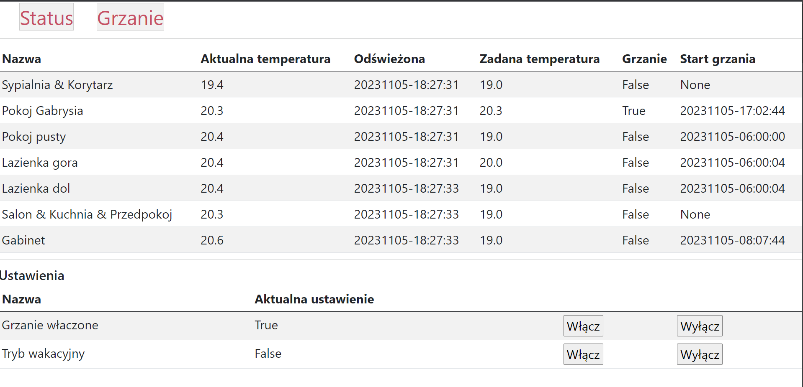
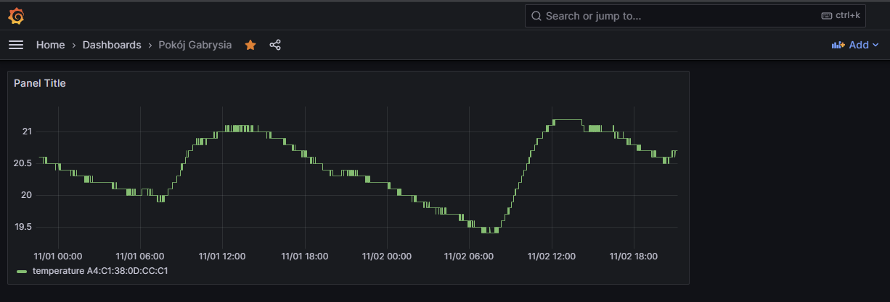

# Smart underfloor heating project

The project is responsible for controlling and maintaining set temperature in each location.
There is also possibility to control each furnace (gas/heating pump) which has on/off switch in API.
---
## Hardware needed:
* Raspberry Pi (at least zero or higher) - one for furnace, one for each floor distrubutor.
* Current-controlled thermostatic head NC(normally closed) or NO(normally open), one per loop of underfloor heating. (for example: Salus T30NC_24V_M30X1_5)
* Optoisolated relays, one per each underfloor heating loop. (for exmaple: https://botland.store/relays/2966-relays-module-8-channels-with-opto-isolation--5904422300531.html#)
* Contact wires for RPi - female. (https://botland.store/82-various-wires)
* Temperature and Humidity sensor Xiaomi (one per room) - https://mi-home.pl/en/products/mi-temperature-humidity-monitor-2
* WAGO different input size -  https://botland.store/electric-cubes/21544-electric-cube-wago-2pin-4mm-32a450v-50pcs-4050821808442.html
---
## Connection diagram

----
## How it works

[my-ufh-temperatures](https://github.com/macmik/my-ufh-temperatures) slave service reads the temperature in loop from each (in range) 
temperature sensor.
The measurements are available via API:
* /state [GET]
```json
{
  "A4:C1:38:0D:CC:C1": {
    "last_updated": "20231105-180623.472728",
    "measurement": {
      "battery": 50,
      "humidity": 56, 
      "temperature": 20.2
  }
},
  "A4:C1:38:24:54:C9": {
    "last_updated": "20231105-180623.682772",
    "measurement": {
      "battery": 44,
      "humidity": 55,
      "temperature": 20.4
  }
},
  "A4:C1:38:50:D3:A1": {
    "last_updated": "20231105-180616.246461",
    "measurement": {
      "battery": 69,
      "humidity": 57,
      "temperature": 20.2
    }
  }
}
```

On top level we can find MAC of the connected device. 
* last_updated - when data was refereshed.
* measurement.battery - battery level of the device.
* measurement.humidity - humidity in the room.
* temperate.temperature - temeprature in the room.

The main application [my-ufh](https://github.com/macmik/my-ufh) requests in loop each slave (my-ufh-temperatures) and 
collect temperature for rooms.

Sample config for `Gabinet` section in main app (more details in config.json file):

```json
 {
      "id": "gabinet",
      "name": "Gabinet",
      "mac": "A4:C1:38:52:CF:61",
      "gpio": 7,
      "slave": "dol"
}
```
On config there is relation between mac and the room and slave.

Settings for the `Gabinet` should be available in some endpoint. Sample settings:

```json
{
  "gabinet": {
    "day": {
      "hour": 7,
      "minute": 0,
      "temperature": 20.5
    },
    "night": {
      "hour": 19,
      "minute": 0,
      "temperature": 19.0
    }
  }
}
```
It means that from 7AM to 19PM the desired temperature is 20.5 degrees. From 19PM to 7AM desired 
temperature is 19.0 degrees.

Now, when the main app (my-ufh) will detect that temperature is below te desired one (with some hysteresis which is possible to set 
in config.json) it will perform following actions:
* Create request to [my-ufh-relay-controller](https://github.com/macmik/my-ufh-relay-controller) to 
enable loop for heating. 
my-ufh-relay-controller is another service with API:
  * /get?gpio=<gpio-number> [GET]- returns whether following GPIO is in LOW (thermostatic head closed) or HIGH (thermostatic head opened) level.
  * /set?gpio=&value=<[0,1]> [POST] - set the gpio value to <value>. Set LOW or HIGH in GPIO.

* Create request to [my-ufh-relay-controller](https://github.com/macmik/my-ufh-relay-controller) which is connected to furnace to turn on the heating.
---
## Features
* SQLite database - store measurements for Grafana
* Web GUI for monitoring and manipulating
* Vacation setting (lowering the required temperatures)
---
## GUI

---
## SQLite database + Grafana


---
